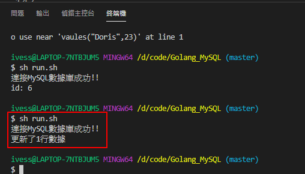

# Golang_MySQL

# 下載依賴

```shell
go get -u -v github.com/go-sql-driver/mysql
```

# 使用MySQL驅動

```go
func Open(driverName, dataSourceName string) (*DB, error)
```

# 建一個測試用的庫

```sql
CREATE DATABASE goTest;
use goTest;
```

# 建一個測試用的數據表

```sql
CREATE TABLE `user` (
    `id` BIGINT(20) NOT NULL AUTO_INCREMENT,
    `name` VARCHAR(20) DEFAULT '',
    `age` INT(11) DEFAULT '0',
    PRIMARY KEY(`id`)
)ENGINE=InnoDB AUTO_INCREMENT=1 DEFAULT CHARSET=utf8mb4;
```


# 插入一些數據
```sql
INSERT INTO `goTest`.`user` (`name`, `age`) VALUES ('IvesShe', '18'); 
INSERT INTO `goTest`.`user` (`name`, `age`) VALUES ('Jack', '30'); 
INSERT INTO `goTest`.`user` (`name`, `age`) VALUES ('ChiChi', '18'); 
INSERT INTO `goTest`.`user` (`name`, `age`) VALUES ('Alex', '25'); 
```


# 查詢的語句

```sql
select * from user;
```


```sql
select id,name,age from user where id=1
select id,name,age from user where id=3
select name,age from user where id=4;
```


# 執行畫面

## 插入數據


## 更新數據




## 刪除數據


## 預處理

- 可以預先讓數據庫編譯，增加效能
- 防止sql注入


## 事務操作

- 全部成功提交，才會更新數據庫


- 只要其中出現失敗，即會回滾


------

# sqlx使用

程式放置 ./sqlx/ 資料夾下

安裝
```shell
go get -u -v github.com/jmoiron/sqlx
```


[參考文檔](https://www.liwenzhou.com/posts/Go/sqlx/)

------

# sql注入

## 任何時候都不應該自己拼接SQL語句

輸入以下字符串都可以引發SQL注入的問題
```shell
"xxx' or 1=1#"
"xxx' union select * from user #"
"xxx' and (select count(*) from user) <10 #"

```
